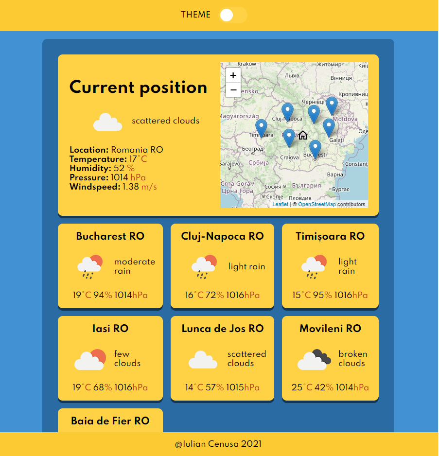

# Weather Expres app

This application will give some weather information on current location ( from browser ) and for the locations selected by the user on the map.

For the map I used [Leaflet.js](https://leafletjs.com/) library and [Open Street Map](https://www.openstreetmap.org/).

Weather data is fetched from [Open weather map API](https://openweathermap.org/api).

## How to use

This project uses [Express JS](https://expressjs.com/) to provide basic server functionality.

Run `npm install` command in order to install dependencies.
After, you can run `npm run dev` to start the development server or `npm run server` in order to start the server.

## Screenshot

## Author

- GitHub - [GitHub Profile](https://github.com/iulian-cenusa)
- CodePen - [CodePen Profile](https://codepen.io/iulian-cenusa/)
- Twitter - [@IulianCenusa](https://twitter.com/IulianCenusa)
- Other Projects - [Bitbucket Profile](https://bitbucket.org/iulian_cenusa/)